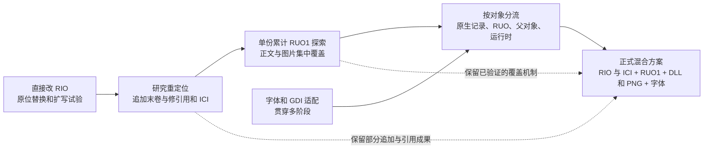
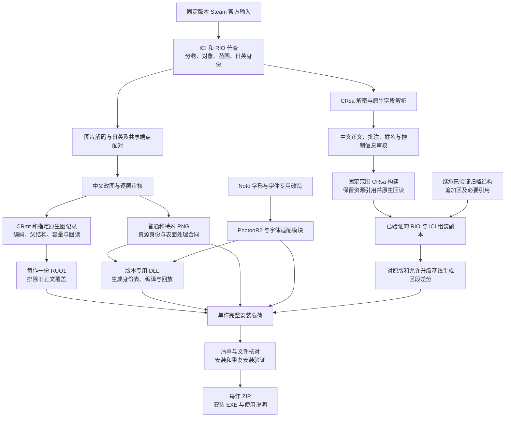
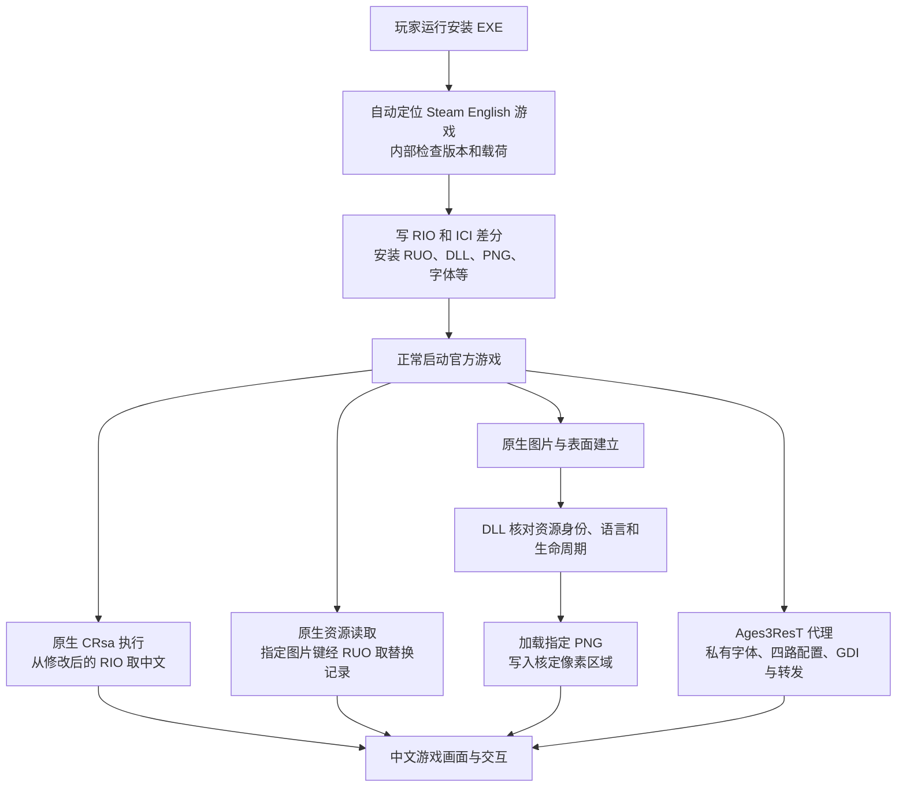

# PF／PM 完整技术蓝图与路线演变

[总览](README.md) · [技术来源分类](provenance.md) · [完整蓝图](blueprint.md) · [证据索引](evidence-index.md)

核查日期：2026-09-12。现行交付锚点：PF **BETA 0.1／2026.09.10-r3**，PM **BETA 0.1.1／2026.09.11-r4**。

范围是两作 Steam rUGP／AGES 汉化的资源研究、文本、图片、字体、运行时、构建、安装和验证。AGE2／FPD、宣传视频及录屏配置不属于这张技术蓝图。

本文件回答三个不同问题：**技术从哪里来；路线为什么改变；正式包实际上怎样工作。** 算法和前人版本的详细哈希见[技术来源复核修订版](provenance.md)。本文件对“最终采用哪条路线”的判断，以实际发布载荷和组装记录为准，补正早期文档可能停留在中间阶段的说法。

## 1. 路线总结：大方向记得对，但中间有多次交叉与收敛

可以概括为：

> **直接修改／扩展 RIO 的探索 → 尽量把正文和图片集中到单份 RUO1 的探索 → 按对象和显示路径分流 → 最终形成 RIO／ICI＋单份 RUO1＋版本专用 DLL／PNG／字体的混合补丁。**

但不能把它写成“第一条完全废弃、第二条完全废弃、第三条从零重来”。各路线曾并行试验，后续也复用了前期成果：

1. 最终仍修改 RIO 和 ICI，而且仍保留历史图片追加数据。
2. 最终仍使用一份 RUO1，但已经不是“全部正文和图片都放在里面”。
3. Hook 并非最后才突然出现：字体路由本来就需要运行时支持；普通图片替换逐步扩大到精确资源身份和表面写入。
4. 9 月 4 日“PF 某轮正文增量走 RUO、PM 某轮增量走原分卷”是中间状态。9 月 10 日最终组装把两作本轮正文显示记录全部固定长度写入 RIO，清除了旧正文 RUO 映射。
5. 开发端“会解码／会编码一种图片”不等于正式包必须用该压缩格式运送全部中文图片。大量图片最终以 PNG 旁置，由 DLL 在合适的显示阶段替换。

这里的箭头表示可证实的技术演变，不表示每个阶段有一个整齐、唯一的切换日。日期以报告正文／构建字段为依据，不把目录复制时间当研究日期。

## 2. 历史阶段与转向原因

### 阶段 A：直接替换 RIO 中的图片，遇到容量与地址问题

目前可直接追到 **2026-07-07** 的 PF quick-save 扩写实机操作记录，不把这一天宣称为整个项目的最初开始日期。

- 旧压缩 payload 为 **13,446 字节**，中文候选为 **26,821 字节**。
- 在 RIO 内插入 **13,375 字节**，文件由 2,147,465,920 增至 2,147,479,295 字节。
- 后一个资源的物理位置随之移动；报告保存了前后地址以及字节回读。
- 报告证明当时确实做了扩写、写入和回读；它本身不证明所有后续对象引用和全游戏运行都已正确。

问题在于，RIO 不是“图片文件顺序拼起来即可”的袋子：目录、原生对象、父引用、分卷地址及 ICI 中的大小信息会引用特定位置。插入更大的数据，不能只让后面的字节挪位而不处理消费者。

直接原位写入在**记录边界与容量足够、内容序列化合法**时仍有价值；问题不是“RIO 永远不能改”，而是不能把可变长度图片任意塞回旧位置。

证据：[7 月 7 日扩写记录（本地记录 L01）](evidence-index.md#l01)。

### 阶段 B：尝试末卷追加、目录重定位与 ICI 同步

在 `rio_rebuild_research_20260810` 中保存了具体 PF quick-save 重定位试验：

1. 把较大的完整图片记录追加到最后一个 RIO 分卷。
2. 修改对应加密目录块中的原始偏移和长度。
3. 更新 ICI 中两个 RIO 大小字段及分配位图。
4. 回读图片记录、目录和 ICI。

这条路线解决了“旧位置装不下”的物理存储问题，但带来父对象、加密引用、目录闭合与 ICI 元数据维护工作。旧试验还存在把对齐字节算入记录 extent 的非标准问题，后续已单独记录；不把历史候选原封不动当成现在的正确模板。

后来 ICI 增长审核发现，我们的早期 helper 在重建外层头时把低三位 metadata 从原件的 **3** 错改成 **7**；另外 RIO 大小有两份，漏改一份也不正确。修正后八组静态候选回读通过，但该修正报告自身标记 `runtime pending / release=false`。这说明研究完成到哪一步，不能单凭静态报告写成八组全部实机验收。

证据：[重定位清单（本地记录 L02）](evidence-index.md#l02)、[ICI 增长复盘](../../../rUGP/docs/postmortems/ici-resize-metadata.md)。

### 阶段 C：验证 RUO，尝试正文和图片统一覆盖

**2026-08-10 的 RUO 研究报告**确认：已有逻辑对象可以保留原路径与原资源键，由 RUO 把读取重定向到另一个完整记录，不受旧物理 extent 的大小限制。

格式为：替换数据＋每项 12 字节映射＋末尾四字节条目数；PF／PM 的地址单位为四字节。研究包含原生加载器／解析器地址、运行中映射表以及独立文件打开探针，证明游戏确实加载了 RUO，而非仅仅在 Python 中解析成功。

同时发现重要限制：虽然游戏扫描多个 `.ruo*`，全局重定向表却共用最后一个 RUO 的归档索引，映射项没有自己的归档编号。因此不能把“文本 RUO1＋图片 RUO2”当成安全的独立叠加层；应合并为**每作一份累计 RUO**。

随后保存的 `photon_complete_patch_v1/release` 的确尝试了集中方案：

| 早期 v1 静态候选 | 图片目标 | RUO 总映射 | 当时状态 |
| --- | ---: | ---: | --- |
| PF | 636 | 692 | 正文＋图片累计 RUO，尚未完成实机验收 |
| PM | 854 | 962 | 正文＋图片累计 RUO，尚未完成实机验收 |

**这正是“我们一度打算尽量全 RUO”的直接证据。** 但该目录虽然叫 release，README 明写静态完成、未安装、未进行游戏内验证；字体及界面 support 也仍在 RUO 之外，不能称所有功能仅靠一个 RUO 文件。

证据：[RUO 原始研究结论（本地记录 L03）](evidence-index.md#l03)、[v1 使用说明（本地记录 L04）](evidence-index.md#l04)、[v1 构建清单（本地记录 L05）](evidence-index.md#l05)。

### 阶段 D：实机与全量样本暴露问题，拆分成多条运输路线

集中 RUO 方案不是因为一个错误就整体判死刑，而是不同层次的问题逐步被区分：

| 问题 | 实际层次 | 对路线的影响 |
| --- | --- | --- |
| Cr6Ti 颜色、条带不对 | 我们早期缓存、clamp、整数语义不一致 | 先修编解码；换容器不能自动修颜色 |
| 中文图片压缩后超出旧范围 | 原生容量 | 需要追加、完整父记录重建、RUO 或运行时替换，不能覆盖后一个对象 |
| 子图解码正确，游戏空白／仍选英文 | 父引用、语言端点、几何、容器封装 | 证明单张 PNG 或叶记录正确不够，须核对实际消费者 |
| 某个状态改好，其他状态没改 | 多状态 bank、共享端点、局部矩形 | 按真实结构和状态绑定，不按“一个按钮一张图”推断 |
| 第一次替换成功，随后恢复原图／撕裂 | 重新解码、表面生命周期、写入时机 | 引入精确身份与生命周期控制的运行时图像路线 |
| 8311：counted CString 内填入 NUL | 文本序列化值不合法 | 禁止嵌入 NUL；此错误不能证明 RUO 本身不可用 |
| PM 部分 CRsa 完全相同地重定向仍报 831 | 特定分卷／对象的重定向行为 | 对已验证问题记录改用原分卷固定范围写入 |
| 字体文件已在磁盘，但不同界面字体不一致 | 注册表四路字体、GDI 请求、首次启动改值 | 引入私有字体及代理 DLL，而非指望资源覆盖解决字体选择 |

早期容量统计中的 118 个可装入、1,317 个超容、4 个待解属于当时的目标去重口径，不能直接相加成某个现行图片总数，也不能把它当现在仍有这些故障。

8 月 27 日的图片安装输入已经明确区分：原生散写、末卷追加、原始引用重绑、加密父对象重编译、CS5i 位点、碰撞组和 ICI；这已经是混合路线的工程形态。

### 阶段 E：普通图片更多转为官方对象承载＋精确 PNG 运行时替换

8 月 28 日 PF、8 月 30 日 PM 的 `official_backing` 记录说明：大量父引用恢复到官方 translation／context 对象，让游戏先沿已知对象结构建立正常表面，再由我们的运行时按确切身份替换中文像素。少量特例仍保留自定义记录和引用。

历史分工数据：

- PF：579 个官方 translation 目标、17 个 context 特例、40 个保留自定义记录；恢复 393 个父引用位点。
- PM：769 个官方 translation 目标、40 个 context 特例、47 个保留自定义记录；有 2 个重叠项目，不能直接相加作总量；恢复 568 个官方或 context 父引用位点。

这些是该历史候选清单的分类，不冒充最终全部映射数量。核心变化是：**不再要求每幅普通中文图都通过重新压缩、变更父记录来显示**。原生解码与编码成果仍用于普查、理解像素、回读、支持特例和建立运行时依据。

该阶段保留了此前追加区。后续正式包并未为了“看上去更纯粹”重新清空所有历史存储布局，因此磁盘上存在的追加图片不必然等于当前实际显示的来源。

### 阶段 F：9 月初补齐文本、CRmt 演出与具体运行时路径

这一阶段有几条并行线：

- CRsa 补提取、注释和绑定：9 月 4 日记录 PF 7 个 CRsa／169 个动作、PM 46 个 CRsa／268 个动作。PF 当轮采用累计 RUO，其中两个记录允许增加批注池；PM 46 个记录采用原分卷等长写入。
- CRmt／CRmti／CRimp：结合 RioX 参考与官方对象研究，处理内嵌层、外部成员、父几何、容量、translation 目标与中文演出素材。
- PM RUO 虚拟基址：针对指定主程序，将资源基址从 6 GiB 调整至 8 GiB；这是地址空间兼容修正，不是修改电脑物理内存容量。
- 图片运行时：补 PM 教程计时画面、CRip008 入口、相册 selector、PF 祭典完整背景和局部招牌等。
- 字体、姓名颜色与排版：处理实际中文字库、选项位图裁切、显示与回看的一致性。

此时仍不能用一句“PF 走 RUO、PM 改 RIO”概括所有功能；那只适用于被引用的某轮文本增量。

证据：[9 月 4 日原生增量记录](../../../rUGP/docs/postmortems/crsa-native-increment-20260904.md)。

### 阶段 G：9 月 10 日最终组装与 BETA 收敛

最终正文组装清单为 **164 个 CRsa、57,723 条显示记录**，全部保持相应原生记录 extent：

- PF：56 个 CRsa、13,025 条，分布在 `.rio` 与 `.rio.002`。
- PM：108 个 CRsa、44,698 条，分布在 `.rio`、`.002`、`.003`、`.004`。

组装脚本把这些记录写入独立组装副本的对应 RIO 范围，并进行原生解析回读。另一个脚本重建 RUO：移除旧 CRsa 正文覆盖，只继承指定图像特例，再加入最新 CRmt 替换记录。这样避免 RIO 内的新文本被旧 RUO 再覆盖。

随后修复了玩家包图片表未排序导致的二分查找失效，形成 R2；再修复回看返回动作，形成 **PF／PM BETA 0.1，内部 r3**。PM 9 月 11 日只更新七个 CRsa 的 297 条特殊字体字段，形成 **BETA 0.1.1，内部 r4**，其他 r3 图像与运行时载荷维持相同身份。

该 297 条是“字段条数”，不是 2,977 条，也不是七个章节。问题来自写回时只恢复了特殊指令的前缀而丢失参数；最终按维护者要求走普通字体，不能描述成游戏原本的字体 bug。

## 3. 正式包现在到底采用什么

本节通过本次脚本实际读取发布包内清单和 RUO、重构差分追加区验证，不只转述 README。

| 正式组成 | PF BETA 0.1 | PM BETA 0.1.1 | 承担的职责 |
| --- | --- | --- | --- |
| 修改基础 RIO | `.rio`、`.rio.002` | `.rio`、`.rio.002`、`.rio.003`、`.rio.004` | 正文／界面原生记录、已保留父引用与特例、历史追加区等 |
| 修改 ICI | 10,888 字节文件，长度不变但内容变化 | 19,592 字节文件，长度不变但内容变化 | 与实际归档结构和大小匹配；不是完全不改目录元数据 |
| 单份 RUO1 | 21 条：**20 CRmt＋1 Cr6Ti kind2** | 30 条：**全部 CRmt** | 已验证的原生图片对象覆盖；两份都没有旧正文 CRsa 覆盖 |
| 普通 PNG sidecars | 1,197 个 | 1,596 个 | 对应普通图片运行时数据，共 2,793 条／文件；不等于同样数量的原创图 |
| 特殊 PNG payloads | 17 个 | 51 个 | 特殊／动态／context 路径，与普通 sidecar 分开 |
| PNG 文件合计 | 1,214 个 | 1,647 个 | 文件数量口径，不是 1,789 审图口径 |
| Ages3ResT.dll | PF 专用组合运行时 | PM 专用组合运行时 | 字体、图片、姓名颜色等已启用路径；PM 另含基址适配 |
| 私有／官方转发模块 | 改字体名的官方资源 DLL | 选项位图 wrapper＋官方转发 DLL | 保留官方插件能力并接入字体专用适配 |
| 字体及许可 | PF PhotonR2＋OFL | PM PhotonR2＋OFL | 版本专用字形与度量，非系统全局替换 |
| EXE／界面资源 DLL | 指定官方文件的补丁版本 | 同类处理 | 字体名与已核定的二进制改动 |

PF 那一条非 CRmt 映射的 source key 为 `0xA3256C75`，111,236 字节；本次用严格 Cr6Ti 解码器确认其完整封装、1024×600、kind2 和像素解码。Cr6Ti 与 CRip008 共享 `00 04 45` 对象前缀，**不能只看这三个字节判断格式**。

50 条 CRmt 映射全部与已确认交接记录的完整 SHA-256 对应。49 个审核逻辑组、50 个目标映射是不同层级的计数，不矛盾。

### RIO 的历史追加区确实留在正式差分里

| 最后一个分卷 | 原版大小 | 正式大小 | 增加 |
| --- | ---: | ---: | ---: |
| PF `.rio.002` | 1,661,470,956 | 1,684,696,824 | 23,225,868 字节 |
| PM `.rio.004` | 1,848,048,356 | 1,883,168,284 | 35,119,928 字节 |

本次直接从**最终安装包的差分数据**重构完整新增区，每一个新增字节都有差分区段覆盖：

- PF 的 23,225,868 字节，与历史 506 条追加记录产物完全同哈希。
- PM 新增区的前 35,079,788 字节，与历史 715 条追加记录产物完全同哈希；后续另有 40,140 字节。

因此不能说“最终只是在所有 RIO 中做等长修改”，也不能说“用了 DLL 后原生追加路线就全没了”。**等长的是本轮正文 CRsa 写回合同，不是整份游戏归档永不增长。**

保留的追加区中有被后续官方承载路线替代的历史数据；不能将“在文件里”当作“每张现在都实际被游戏请求”。本次没有为了来源研究改动或清理正式包。

## 4. 正式工作流程图

### 制作端：从官方输入到玩家包

### 玩家端：三条资源路径配合字体与系统适配

安装器内部校验不等于要求玩家手动逐项校对。正常玩家操作仍是解压、运行对应安装器、点击安装、正常启动。按维护者已确认方案，安装器不创建备份、不提供卸载／回滚；这项玩家策略与历史研发时保留试验前快照不是一回事。

## 5. 技术总表：逐组件划分移植、参考与本项目完成

分类按技术职责，不是把每个 helper、测试文件、尝试版本都重复算成一项发明。

- **A＝直接移植／复用**：明确用了前人的代码实现，或注明为现成内容复用。移植后的扩展仍是我们的工作。
- **B＝参考具体前人实现再编写／适配**：前人提供该组件的算法或状态规则，我们重实现、扩展、适配。
- **C＝本项目研究／编写／完成**：已查到本项目实现与实验记录，没有发现移植前人该组件实现的证据。研究官方游戏程序属于这类逆向工作的输入，不因此自动变成 B；但不宣称发明官方格式或全球首创。
- **外部基础**：官方作品、Windows、字体原始字形、通用库和平台能力，不硬塞进我们的技术贡献。自写代码调用库，不意味着整项工作全归库，也不意味着库能力属于我们。

状态分为“正式构成”“制作／验证工具”“历史试验”“中间生产路线”“后续维护”。已验证子集不扩大成全部 rUGP／AGES 版本。

### 5.1 上游版本索引

| 代号 | 来源与实际版本 | 主要提供什么 |
| --- | --- | --- |
| G | GARbro／morkt `b09ee4570ccb1daf6ac56710ee8934dc0b8baeb0` | ArcRIO.cs、ImageRIP.cs |
| AFE | AFHook／AFEditor／eplightning `3f613a097c07d3d9fb9969a130ea6d859b544f8a` | Cr6Ti 编解码、文本／图片／名字颜色 Hook 先例 |
| ALT | 本机 tsudoko/chinesize 副本 `ad5bdad900e31edf2a17640d1d243470a58b29a8` | `Rugp/alterdec/src2/r6ti.cpp`；当前 GitHub 名称重定向为 tsdko |
| RGT | rugptools／osmium76 `3ff587416e41eeeee7122fb122c90f7a36c409dd` | rUGP 与 alterdec 行为研究，Cr6Ti 预测知识链 |
| RX | muzhi，RioX **1.2.143.810**，随包日期 2013-10-08 | CRmti 整数、位流、行范围与预测的反汇编参考 |
| N | Noto Sans SC 可变字体，`Version 2.04;241114210130;non-release` | 基础中文字形；输入 SHA-256 `763146584CF0710223441356B4395E279021B0806C196614377A7A0174AE074A` |

### 5.2 归档、资源身份与运输

| ID | 技术 | 分类、来源 | 本项目具体工作与状态 |
| --- | --- | --- | --- |
| R01 | RIO／ICI 目录读取 | **A，G** | ArcRIO.cs 的 Python 移植；制作端入口，非从零发现目录格式。 |
| R02 | ICI 字节重排、差分与异或 | **B，G** | 对应 DecryptIci 的实现；补加密逆过程及校验。 |
| R03 | RIO 分块加密、校验与密钥推进 | **B，G** | 对应 ReadEncrypted；用于 CRsa、目录等读取与重建。 |
| R04 | 编码偏移／长度与四字节单位 | **B，G＋官方样本** | 实现正逆变换，核实 PF／PM unit=4；避免套用主篇／AL unit=2。 |
| R05 | 分卷定位、范围及父对象身份 | **C，建立在 R01 上** | 把逻辑对象绑定到卷、物理范围、hash、父引用；制作与运行时身份依据。 |
| R06 | 日文／translation 资源配对 | **C** | 验证真实语言字段、重复物理目标与别名；不能靠相邻偏移或相似图片配对。 |
| R07 | shared／common 端点证明 | **C** | 区分双语父对象共用字段、单一状态 bank、单一 UI 父端点；历史 42 项不是日文回退捷径。 |
| R08 | 末卷追加与引用重定位 | **C，官方结构研究** | 追加完整记录，更新原始引用或重编加密父对象；历史试验，部分结果仍在正式归档。 |
| R09 | ICI 双大小字段、位图与包装头同步 | **C，复用 R02 算法** | 发现双份 size、低位 metadata 保留及位图增长需求；历史特定 helper 与正式固化输入，不是公开万能重封器。 |
| R10 | RUO footer／重定向与累计合并 | **C，官方加载器研究** | 确定三字段、末尾计数、原键到新记录的映射；实现 writer、parser、重复键替换和单文件累计。格式本身归官方。 |
| R11 | 多 RUO 共用归档索引限制 | **C，静态与运行探针** | 明确为什么不能安全叠加独立 RUO1／RUO2；正式每作一份。 |
| R12 | 同一父记录内文本与图像引用合并 | **C** | 重建文字时继承已确认图片引用，避免不同 writer 互相覆盖；最终文本核验包含 2,637 个资源引用。 |

### 5.3 文本解析、写回、排版与语义保护

| ID | 技术 | 分类、来源 | 本项目具体工作与状态 |
| --- | --- | --- | --- |
| T01 | CRsa 加密包装读取 | **B＋C** | 密码流程沿用已知算法；目标头、extent、payload 边界和身份回读为项目实现。 |
| T02 | CString 与 CVM 指令顺序解析 | **C，官方目标布局研究** | counted CString、命令描述符、字段、索引和后缀；不是正则搜到日文就替换。 |
| T03 | CVmMsg3 原文／正文／批注三字段 | **C** | 字符串池、语言列和注释索引的准确语义与绑定；用于补译及写入。 |
| T04 | 全 CRsa 原生字段普查 | **C** | PF 201／PM 265 个官方记录，区分正文、调用参数、注释及非待译兵装字段。 |
| T05 | 漏显示字段与动态提示提取 | **C** | 补训练对白、打西瓜方向距离等普通正文导出之外的显示字段。 |
| T06 | 原文批注保留与中文批注重绑 | **C** | 修复源注释索引、选择可用槽和正文唯一短键，区分译义与纯日语注音。 |
| T07 | UTF-16 容量与边界控制 | **C** | 按代码单元计数；区分 counted 值、池终止 NUL、前后控制符和可见文案。 |
| T08 | 8311 内嵌 NUL 根因差分试验 | **C** | 同结构下比较 NUL 补齐、单字符改动与自然等长中文，排除中文本身和保持不变的容器因素。 |
| T09 | 固定范围写回与原生重加密 | **C，复用 R03** | 替换已确认文本而保持非目标池、命令、声音及图片引用；最终正文采用此路线。 |
| T10 | 文本池 append／rewire | **C** | 扩池与改命令索引的证明性实现；历史／中间特许批注增量，非最终全部正文默认策略。 |
| T11 | 两游戏文本运输分流与最终合并 | **C** | PM 某些 identity RUO 失败后写原卷；最终两作 164 个显示 CRsa 均按固定范围归入 RIO。 |
| T12 | 换行、姓名边界、菜单宽度 | **C，使用外部字体度量** | 中文排版、字符预算、PUA 菜单与小字布局检查；保守超预算不自动当实机溢出。 |
| T13 | 特殊文本前缀／普通字体修复 | **C，修复项目回归** | PM 297 条 U+0010 指令残缺，最终按要求普通字体化；只改七个 CRsa，PF 无同类受影响项。 |
| T14 | 引擎动作与可见文案分离 | **C，修复项目回归** | “返回游戏”图片可翻译，原生动作标识不能翻译；构建器验证对应 CVmCall。 |
| T15 | 姓名／专名／军衔一致性 | **C 的本地化规则实现** | 沿官方语境与既有系列译名，维护术语源、别名、替换边界；译名本身不全部归原创。 |
| T16 | 可维护翻译表与来源哈希 | **C** | binding ID、显示字符串、注释、控制符、审校理由和源摘要；审核文字与实际 runtime_text 分开保存。 |

### 5.4 图片格式与中文制作

| ID | 技术 | 分类、来源 | 本项目具体工作与状态 |
| --- | --- | --- | --- |
| I01 | Cr6Ti 像素编解码 | **B，AFE＋ALT** | 基于上游状态机编写 Python 实现；AFEditor 已有编码器，不能称全从零。 |
| I02 | Cr6Ti 透明缓存、裁限、除法修正 | **C 的移植修复，依据 B** | 修正我们旧代码偏离正确上游规则的问题；不包装成上游普遍有 bug。 |
| I03 | Cr6Ti 回读器与官方 census | **C 的验证实现，格式知识 B** | 分离实现、样本 hash、准确 trailer／extent 检查；“独立”指实现分离。 |
| I04 | CRip007 解码 | **B，G＋官方原生适配** | 原生高字节、RGB mask、uint32、预测与符号规则；旧 Python 偏差与上游行为分别归因。 |
| I05 | CRip007 中文灰度编码 | **C 的扩展，建立在 I04** | 8／8／8 精度保存抗锯齿灰度，完整 payload 与独立回读；限定已验证子集。 |
| I06 | **CRip008 解码器** | **C，本项目研究并实现** | 从官方头、原生 MSB reader、4096 项整数表、预测和 Alpha 重建；未查到移植前人 CRip008 实现证据。 |
| I07 | **CRip008 kind2／kind3 编码器** | **C，本项目研究并实现** | 逆编码、8／8／8 字面量行、透明 run、部分 Alpha 与完整回读；未声称所有理论 profile。 |
| I08 | CRmti 位流与预测编解码 | **B，RX＋ALT／RGT 基础** | 按 RioX 反汇编补宽／短整数、位序、空行起点和透明段规则，编写本项目读写器。 |
| I09 | CRmt 父结构与内嵌／外部成员 | **C，官方对象研究** | 识别封装和已验证父布局，区分 mip、外部图像和真正的动态状态；不把所有层叫动画帧。 |
| I10 | CRimp 类型化属性 | **C，官方对象研究** | 有符号分量、低位类型标签、原点消费路径；不是像素解码器，不任意当 16.16。 |
| I11 | CRmti 容量和父几何 | **C** | 检查原生解码缓冲、尺寸、draw rectangle 与跨语言父布局；文件压得小不等于解码内存一定够。 |
| I12 | 多级中文图层与重采样 | **C 的集成，通用算法／库外部** | 使用预乘 Alpha 与规定缩放生成各层，保持封装、父几何和目标容量；没有发明 Lanczos。 |
| I13 | 中文原图处理与文案排版 | **内容复用＋C 制作** | 官方图上擦字、修底、中文文案和排版；部分模型辅助、部分用户成图，不称原创原画。 |
| I14 | Alpha／边界／改动区域一致性 | **C 的验证与处理** | 检查目标外 RGBA、透明轮廓、同组版本和文字布局；不能只靠缩略图看着像。 |
| I15 | 原图—成图—编码—目标映射账本 | **C** | 保留输入、批准图、记录、语言端点与运行观察的不同身份；解决旧稿、漏装及重复计数。 |
| I16 | 模型辅助图像生成与语音识别 | **外部模型＋C 工作流程** | GPT Image 等辅助制作；本地 ASR 辅助确认语音控制提示；模型能力不算自研，识别不冒充人工听校。 |

### 5.5 运行时、原生挂接与具体故障修复

| ID | 技术 | 分类、来源 | 本项目具体工作与状态 |
| --- | --- | --- | --- |
| H01 | 32 位 Ages3ResT 代理与导出转发 | **C，AFE 有架构先例** | 自写 PF／PM DLL，转发官方导出、首次调用时初始化；不直接分发整套 AFHook DLL。 |
| H02 | 指定 EXE／DLL 身份与地址定位 | **C，官方程序分析** | 地址／RVA、原字节、调用约定、ASLR 处理与版本检查；未知目标不猜地址。 |
| H03 | 原生图片函数挂接与汇编转发 | **C，AFE 有图片 Hook 先例** | PF／PM 不同入口、参数和寄存器保存；并不声称首次提出 Hook。 |
| H04 | 普通图片精确身份查找 | **C** | 卷、资源键、长度／hash 等绑定到旁置中文图；生成表、排序和二分查找。 |
| H05 | PNG 加载与原生像素表面转换 | **C 集成，WIC 为外部基础** | 路径、文件和尺寸核对，再做行距、像素排列与 Alpha／局部区域处理；通用 PNG 解码归 WIC。 |
| H06 | 字段语言与 selector 生命周期 | **C** | 原文／translation／未知状态；真实设置动作、context 和资源证据绑定，失效时撤销旧状态。 |
| H07 | 表面写入事务与旧表面隔离 | **C** | 核对画布、stride、写入范围、生命周期与在途写入，避免旧身份写新表面或重复绘制。 |
| H08 | shared／state bank／特殊 context | **C** | 多状态布局、共用端点、完整帧和动态标签不同处理，避免日文槽误写。 |
| H09 | PM 教程计时与零秒圈线 | **C** | 11 个独立完整教程 payload 的准入及 selector 修复；中文文字与标记圈合成。 |
| H10 | PF 祭典背景与局部招牌 | **C，修复本项目漏替换** | 核对实际长度编码、整幅背景和 232×253 局部矩形；缩略图通过不代替演出。 |
| H11 | PM Extra 相册与图像准入 | **C，修复本项目运行时** | 清理失效语言绑定、匹配实际 hook 数量及准入合同，解决已复现崩溃／遗漏。 |
| H12 | PM RUO 6 GiB→8 GiB 基址 | **C，官方地址行为研究** | 指定 PM EXE 内存位置修正，避免 RUO 虚拟资源地址冲突；配合正式运行时。 |
| H13 | 姓名颜色别名与缓存绑定 | **C 实现，AFE 有能力先例** | PF／PM 中文说话者和已核定颜色映射；不宣称首次实现 rUGP 名字颜色。 |
| H14 | 诊断探针与日志对账 | **C，通用调试能力外部** | 请求键、载荷、表面、提交和回读记录；区分“载入”“绘制”“可见”；诊断工具不等于玩家必装。 |

### 5.6 字体与系统界面

| ID | 技术 | 分类、来源 | 本项目具体工作与状态 |
| --- | --- | --- | --- |
| F01 | 基础汉字字形 | **A 的字体内容复用，N** | Noto Sans SC；保留 OFL 与版权，不称自制整套字库。 |
| F02 | 静态化、子集、度量与 codepage | **C 适配，fontTools 等外部** | wght=400、所需码点、hhea／OS2 度量和覆盖检查。 |
| F03 | PhotonCN／PhotonR2 独立家族名 | **C 适配** | 避免系统同名字体解析干扰；不仅更改磁盘文件名。 |
| F04 | U+2060 零宽字形与容量配套 | **C 适配** | 与允许的容量补齐合同联动；不能泛化为随处插不可见字符。 |
| F05 | 四条注册表字体路由与 guardian | **C，Windows 基础能力** | 首次启动／路由改写后保持本游戏的私有字体配置。 |
| F06 | CreateFontIndirectW 路由 | **C 版本适配，通用 Hook 有先例** | 处理主程序单一导入的 face-name，配合私有字体注册。 |
| F07 | PM 选项 PUA／GetGlyphOutlineW | **C** | 227 个别名与四倍栅格化后的边缘处理，固定缓冲边界；独立 wrapper 实际入包。 |
| F08 | 竖向度量、缺字及 UI 字体名 | **C 适配，原字形和官方 PE 外部** | vmtx 修复、指定缺字供体、系统资源 DLL／EXE 字体名修改及精确 hash 绑定。 |

### 5.7 发布、安装、协作与验证

| ID | 技术 | 分类、来源 | 本项目具体工作与状态 |
| --- | --- | --- | --- |
| P01 | 中文权威输入的最终组装 | **C** | 选择已核定正文、图片、CRmt、字体和 DLL，保留源链；不凭文件修改时间挑“最新”。 |
| P02 | RIO／ICI 区段差分 | **C，通用差分思想** | 对原版及允许升级基线取所需区段并校验最终虚拟文件，含新增尾部；不是重新发整套游戏。 |
| P03 | 包清单、封条与完整文件身份 | **C** | 绑定相应版本、目标范围、输入与输出 hash、固定文件和资产数量。 |
| P04 | Windows 单 EXE 包装 | **C，.NET／PowerShell 外部** | EXE 内嵌 payload ZIP、目录选择、进度和错误处理，玩家无需 Python。 |
| P05 | Steam 目录与 English 状态识别 | **C，Steam 配置外部** | App ID、两处语言字段、库目录和 Junction 物理路径；避免把 D→C 的别名当两套游戏。 |
| P06 | 无备份安装、重复安装与失败提示 | **C，维护者产品决定** | 当前直接写差分与文件；同版完成态不重复写；无卸载／回滚；历史有备份工具不代表正式仍使用。 |
| P07 | 确定性构建与 PE 元数据归一 | **C 流程，编译器／压缩库外部** | 双编译、限定时间戳与 PDB 标识归一、固定 ZIP 时间和输入身份；环境边界明确。 |
| P08 | PF／PM 独立版本与 GitHub 发布 | **C 流程，GitHub 外部** | 分开 EXE／ZIP、普通 Release、附件 hash、下载后安装验证、已知旧版升级。 |
| P09 | ParaTranz 同步与审校合并 | **C，ParaTranz API／GitHub Actions 外部** | 稳定 ID、源／译文摘要、双方冲突、控制符保护和待审 PR；后续维护，不算最初解包成果。 |
| Q01 | 原生 no-op／字节同一性验证 | **C 的项目验证** | 不改内容时解密／重编码应闭合；不等于逻辑与运行都正确。 |
| Q02 | 图片编解码独立回读 | **C 的验证，算法出处照旧** | 像素、Alpha、封装、长度与 bitstream 消费；避免同一错误模型自证。 |
| Q03 | 资源图与表格闭合检查 | **C** | 语言字段、父引用、共享状态、重复键、全量查找和资源引用保护。 |
| Q04 | 真输入离线 hook 回放 | **C** | 用实际归档和 sidecar 核查完整／局部像素、stride、边界；不代替实机选路。 |
| Q05 | 单变量实机与用户复测 | **C 的项目研究方法** | 基线／identity／中文变体，配合崩溃、字体、相册、演出、回看和读档取证；通用方法不是我们的发明。 |
| Q06 | 包内载荷及安装结果验证 | **C** | 原版、允许旧版、重复安装、错误输入及实际下载附件；安装通过不等于全剧情遍历。 |
| Q07 | 脚本、截图、记录与 hash 证据保存 | **C 流程，通用工具外部** | 将候选、被否决试验、实机结果和正式身份分开，避免把旧 PASS 赋给新包。 |

### 5.8 不计入本项目原创技术的外部能力

官方剧本、插画、角色、UI 原图、声音、游戏演出、引擎格式和 Steam 成就属于官方；Noto 原始字形属于字体上游。Windows GDI／WIC、Python、NumPy、Pillow、fontTools、Zig／Clang、.NET、zlib、pefile、反汇编工具、语音／图像模型和平台 API 提供基础能力。本项目贡献是针对游戏的研究、程序、输入处理、绑定、集成和实际修复。

thcrap、07th-Mod、Committee of Zero、Tsukihimates、VNTranslationTools、Kuriimu2 的现有记录只支持工作流／组织设计参考，不把它们当成 PF／PM 编解码或安装器的直接源码来源。其他本机保存的 GARbro 分支等无明确采用证据者，仍列在来源报告的“候选工具”中。

## 6. 从表里的技术到实际代码和证据

为避免总表变成没有依据的工作清单，下列入口对应每一技术层。公开源码、旧私有脚本、固化输入和已发包不是同一集合；现行通用 helper 也不必然覆盖某个历史专用试验的全部模式。

| 技术层 | 主要可审阅入口 | 能证明什么 |
| --- | --- | --- |
| 归档读取与加密 | [rio_inventory.py](../../../rUGP/tools/catalog/rio_inventory.py)、[crypto.py](../../../rUGP/formats/rio/crypto.py)、[ruo.py](../../../rUGP/formats/rio/ruo.py) | 来源声明、算法实现、偏移／长度与 footer 合同 |
| 原生文本 | [crsa_vm_stream.py](../../../rUGP/formats/rio/crsa_vm_stream.py)、[crsa_vm_edit.py](../../../rUGP/formats/rio/crsa_vm_edit.py)、[crsa_vm_rewire.py](../../../rUGP/formats/rio/crsa_vm_rewire.py) | 顺序解析、索引和字段编辑；不把可运行的实验 writer 自动当生产默认 |
| 最终正文组装 | [最终固定范围处理（本地记录 L06）](evidence-index.md#l06)、[写入组装副本（本地记录 L07）](evidence-index.md#l07)、[最终清单（本地记录 L08）](evidence-index.md#l08) | 164 个记录、57,723 条、全部固定 extent，具体范围与产物身份；早期脚本默认输出名需结合交接看 |
| 最终 RUO 组装 | [assemble_archives.py（本地记录 L09）](evidence-index.md#l09) | 明确移除旧正文 RUO，保留指定图像记录并合并 CRmt；本次另直接解析成品验证结果 |
| 图片编解码 | [格式目录说明](../../../rUGP/formats/images/README.md)、[CRip008 研究](../../../rUGP/docs/postmortems/crip008.md)、[CRmt 对象说明](../../../rUGP/docs/crmt-family.md) | 各自封装、位流、预测、Alpha、对象结构和支持范围 |
| 图片运输转向 | [图像运行时复盘](../../../rUGP/docs/postmortems/image-transport-runtime.md)、[shared／common](../../../rUGP/docs/postmortems/shared-common-images.md) | 为什么 bitmap 正确仍不显示，以及为何按真实端点分流 |
| 早期 V6 分流 | [8 月 27 日安装输入（本地记录 L10）](evidence-index.md#l10) | 追加、ICI、scatter、原始／加密引用、CS5i 与碰撞组；本清单自身是静态状态 |
| 恢复官方对象承载 | [PF 8 月 28 日清单（本地记录 L11）](evidence-index.md#l11)、[PM 8 月 30 日清单（本地记录 L12）](evidence-index.md#l12) | 明确的父引用恢复、少量自定义记录保留与 PNG 身份路由 |
| 运行时核心 | [代理入口](../../../rUGP/runtime/src/photon_combined_proxy.c)、[表面写入事务](../../../rUGP/runtime/src/photon_v6_surface_transaction.c)、[精确 PNG 加载器](../../../rUGP/runtime/src/photon_v6_exact_rgba_sidecar_loader.c)、[构建器](../../../rUGP/runtime/build.py) | 正式 C／汇编模块、配置身份与构建方式；不凭当前默认 profile 推断所有历史 DLL |
| 字体 | [字体运行时复盘](../../../rUGP/docs/postmortems/font-runtime.md)、[原始 PhotonCN 构建审计（本地记录 L13）](evidence-index.md#l13) | 上游字形、子集、名称、四路配置与 GDI 的不同职责 |
| 玩家组装与安装 | [build_photon_player.py](../../../rUGP/packaging/build_photon_player.py)、[PhotonInstaller.cs](../../../rUGP/packaging/windows/PhotonInstaller.cs)、[Install-PhotonCN.ps1](../../../rUGP/packaging/windows/Install-PhotonCN.ps1) | 差分、升级基线、EXE 包装、无备份安装与自动检查 |
| 版本修复 | [图片索引](../../../rUGP/docs/postmortems/player-image-index-20260910.md)、[回看动作](../../../rUGP/docs/postmortems/backlog-return-action-20260910.md)、[PM 特殊字体](../../../rUGP/docs/postmortems/pm-special-text-20260911.md) | R2→r3→PM r4 的具体内容变化及缺陷归属 |

## 7. 本次新增核验结果

本次没有重新安装或启动游戏，没有再打一份补丁。执行的是与“技术路线实际归属”直接相关的只读检查：

1. **两份正式清单**：核对 PF r3、PM r4，而非旧小写 beta0.1 或未发布候选。
2. **实际 RUO 文件**：完整文件 hash 与包清单一致，解析全部映射；50 个 CRmt 载荷匹配历史确认记录 hash；PF 剩余一个 Cr6Ti 用严格解码器解析和解码。
3. **最终差分里的追加区**：直接从补丁 segment 重构每个新增字节，证明完整覆盖；PF、PM 历史追加前缀 hash 均匹配，没有拿开发目录大小作猜测。
4. **最终文本清单**：164 个固定范围 CRsa、57,723 条；r3 回看修复与 r4 七记录修复另由对应构建／发布记录衔接。
5. **GitHub 发布身份**：本次再次读取两个 Release，均 `prerelease=false`；PF ZIP 为 112,873,626 字节，PM ZIP 为 152,585,277 字节。

| 发布件 | GitHub 本次返回的 SHA-256 |
| --- | --- |
| PF BETA 0.1 ZIP | `E8933FAB8D3E4285A82269653B3F58D738BA6B2803BC2C96B956D5D148EFCCC3` |
| PM BETA 0.1.1 ZIP | `85D9D023494570ABC7025F10F924517706E706B722B86515C43AD5D34C5D9BAF` |

发布页：[PF BETA 0.1](https://github.com/imnotsureyi-sys/muvluv-series-steam-cn-patch/releases/tag/pf-BETA-0.1)、[PM BETA 0.1.1](https://github.com/imnotsureyi-sys/muvluv-series-steam-cn-patch/releases/tag/pm-BETA-0.1.1)。PF GitHub UTC 发布时间为 9 月 9 日 17:36:54，对应悉尼 9 月 10 日凌晨；不能因时区差异误判为另一份 9 月 9 日包。

机器可读结果：[release-route-audit.json](evidence/release-route-audit.json)。复核脚本：[audit_routes.py（本地记录 L14）](evidence-index.md#l14)。脚本只读本地旧记录和正式载荷，通过 `gh api` 只读查询 Release，并把结果写到本报告目录；不写游戏。

### 证据强度与范围

- 历史路径、源文件、哈希能证明发生过相应实现和试验；不能仅凭文件名叫 final／release 认定已验收。
- 静态解码能证明相应样本和算法合同；不能证明游戏实际选中该对象。
- 实机载荷进入内存不等于已绘制；画面出现也不自动证明所有状态／全部分支。
- 玩家安装和文件 hash 一致，不等于整部作品全剧情走完。
- 本次完整列举的是目前有证据的组件与路线，不声称逐行恢复全部历史编程过程，也不把未保存的初始想法补写成事实。
- 外部译文逐句采用、部分图片逐图制作作者／模型／字体仍有来源缺口，沿用来源报告的边界；这不妨碍技术运输路线已从实际包核实。
